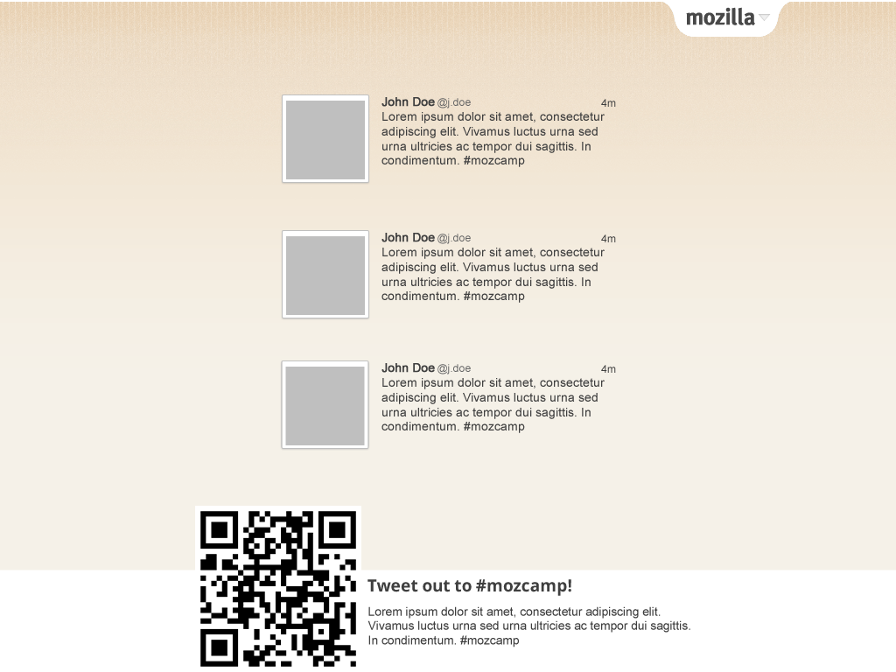
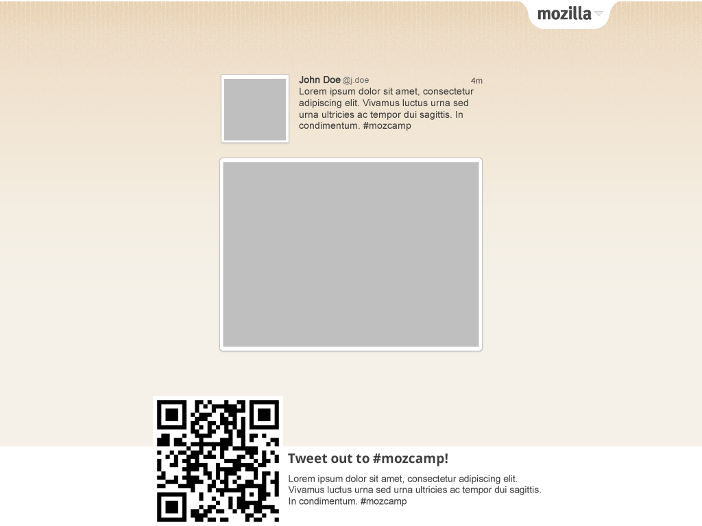

# tweet-screen
This is the screen that will display tweets at MozCamp Europe 2012. It uses php to prefetch tweets and images, process into displays, cache them, then display them on a timer.

## mockups

## license
This Source Code is subject to the terms of the Mozilla Public
License, v. 2.0. If a copy of the MPL was not distributed with this
file, You can obtain one at http://mozilla.org/MPL/2.0/.